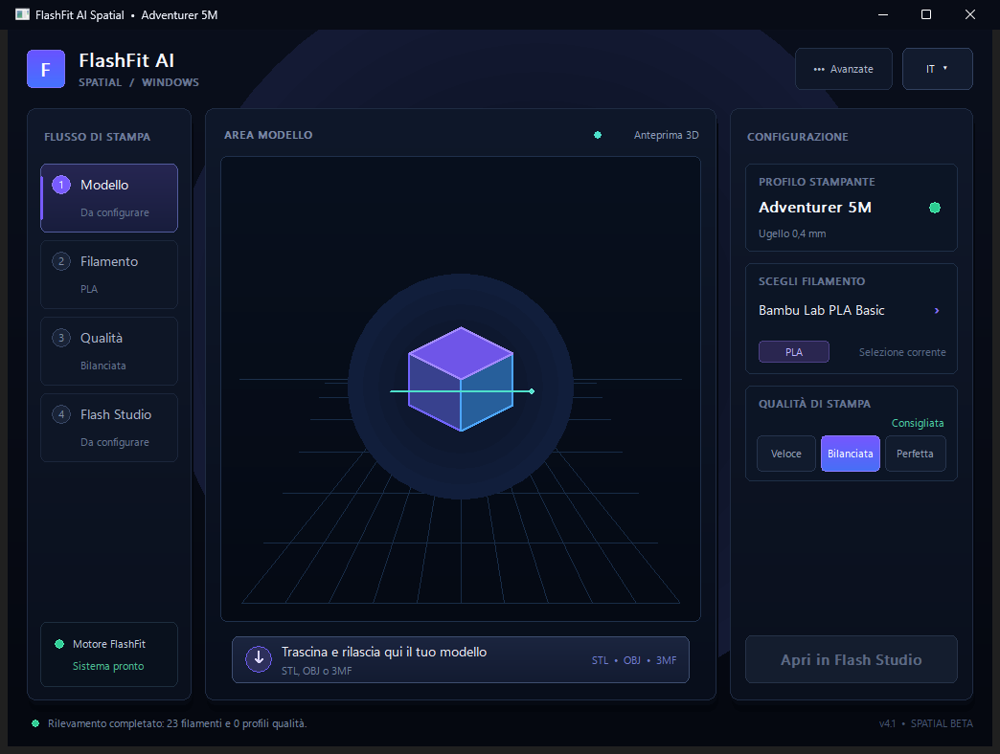

# FlashFit AI

FlashFit AI is an Italian project that analyzes 3D models and automatically prepares guarded slicing settings for supported Flashforge and Bambu Lab printers.

It is an independent project created and developed by a single Italian developer. FlashFit AI began with a simple frustration: advanced slicers are powerful, but finding the right combination of settings for every model and filament is still unnecessarily difficult. The project grew from that idea into a focused assistant that studies the geometry first and builds a safer, more appropriate printing strategy around it.

The application inspects the actual mesh—including dimensions, topology, overhangs, surface orientation, fine details, separate bodies, and geometric proportions—then adapts print speed, acceleration, walls, infill, supports, cooling, adhesion, ironing, and material parameters.

## Official downloads

- [Windows 11 x64 — FlashFit AI 4.3 Multi-Printer Engineering Beta](https://github.com/alexmark53343-byte/FlashFit-AI/raw/refs/heads/main/downloads/FlashFit-AI-Windows-11-x64.zip)
- [macOS Apple Silicon — FlashFit AI 3.6 Beta](https://github.com/alexmark53343-byte/FlashFit-AI/releases/download/v3.6-beta/FlashFit-AI-Apple-Silicon.zip)

## Current release

- Native Windows 11 x64 application with a professional three-plane Spatial workspace
- Dedicated print workflow, 3D model stage and technical configuration inspector
- Native macOS application for Apple Silicon (M1, M2, M3, M4 and newer), unchanged at version 3.6 Beta
- Instant full-interface language switching: English, Italian, French, Spanish, and German
- Responsive model and slicer discovery through isolated background workers
- Persistent GDI backbuffers, bounded resize caches, and idle-aware minimal animation to prevent Windows UI stalls
- Automated one-second responsiveness and GDI-lifetime stress test for Windows release candidates
- Embedded Windows icon, DPI-aware manifest, and Explorer version metadata
- Automatic detection and selection of 20 installed 0.4 mm printer families: 6 Flashforge and 14 Bambu Lab
- Flash Studio Desktop, Bambu Studio and compatible Orca command-line engines
- Printer-specific build-volume, hotend, bed, motion and acceleration guardrails
- Vendor machine G-code, retraction, Flow Dynamics/Pressure Advance, purge, wipe and tool-change behavior preserved
- Current Flashforge coverage: Creator 5, Creator 5 Pro, Adventurer 5M, Adventurer 5M Pro, AD5X and Guider 3 Ultra
- Bambu Lab coverage: A1 mini, A1, A2L, P1P, P1S, P2S, X1, X1 Carbon, X1E, X2D, H2C, H2D, H2D Pro and H2S
- Single-material optimization workflow; vendor multi-material mechanics remain untouched
- STL, OBJ, and 3MF analysis
- Fast, Balanced, and Perfect print strategies with duration-aware quality scaling
- 23 built-in safe PLA/PETG baselines plus compatible official profiles discovered from the installed slicer
- Optional measured per-spool overrides for temperature, volumetric flow, pressure advance, and flow ratio
- Direct verified 3MF generation and opening in the selected slicer

## Platform availability

FlashFit AI is currently available as **Windows 11 x64 4.3 Multi-Printer Engineering Beta** and **macOS Apple Silicon 3.6 Beta**.

## Beta notice

This is a free beta. Always review the generated slicing preview before printing. Material behavior can vary between colors, production batches, storage conditions, and individual printers.

ABS can warp and release fumes. Large ABS parts generally require an enclosure and suitable ventilation; software settings cannot replace those physical protections.

## Installation

1. Download `FlashFit-AI-Apple-Silicon.zip` using the macOS link above.
2. Extract `FlashFit AI.app`.
3. Move the app to the Applications folder.
4. Open a model and verify the generated project in the selected slicer before printing.

### Windows 11

1. Download and extract `FlashFit-AI-Windows-11-x64.zip`.
2. Run `FlashFit-AI-Windows-11.exe`.
3. This test beta is not yet Authenticode-signed, so Windows SmartScreen may warn about an unknown publisher. Continue only when downloading from this official repository and compare the executable against the included `SHA256SUMS.txt`.

## Project origin

Designed and developed in Italy by one independent developer. 🇮🇹

The project is intentionally small and personal. The application and its profile engine are maintained exclusively by its original developer; this public repository distributes compiled beta releases and public documentation only.

## Windows 4.3 Spatial Multi-Printer UI

